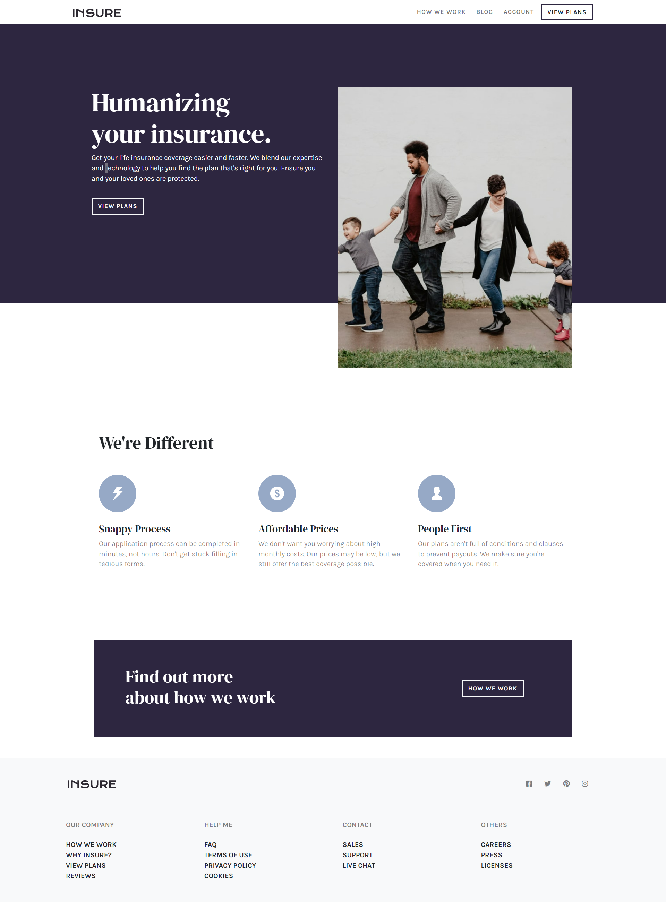

# Frontend Mentor - Insure landing page solution

This is a solution to the [Insure landing page challenge on Frontend Mentor](https://www.frontendmentor.io/challenges/insure-landing-page-uTU68JV8). Frontend Mentor challenges help you improve your coding skills by building realistic projects. 
## Table of Contents

- [Overview](#overview)
  - [The Challenge](#the-challenge)
  - [Screenshot](#screenshot)
  - [Links](#links)
- [My process](#my-process)
  - [Built With](#built-with)
  - [What I Learned](#what-i-learned)
  - [Continued Development](#continued-development)
  - [Useful resources](#useful-resources)

## Overview 

### The challenge

Users should be able to:

- View the optimal layout for the site depending on their device's screen size
- See hover states for all interactive elements on the page

### Screenshot

### Links

- [GitHub Repo URL](https://github.com/adrvnc/insure-landing-page)
- [Live Site URL](https://adrvnc.github.io/insure-landing-page/)

## My Process

### Built With 

- HTML 
- CSS
- Bootstrap 5.1.3
### What I Learned 

I learned how to realign content using different viewport sizes 
with bootstrap. For example, if I want to align a paragraph to the center
for mobile devices and tablets, I would use `text-center`. However, If 
I want to realign the paragraph to the left on larger viewports, 
such as a desktop; I would use `text-lg-start`. 

### Continued Development 

Over time, I hope to become more comfortable building 
multi-section landing pages. 

### Useful Resources 

[Bootstrap Text Alignment](https://getbootstrap.com/docs/5.0/utilities/text/) - This helped me learn how to realign text using different viewport sizes.
